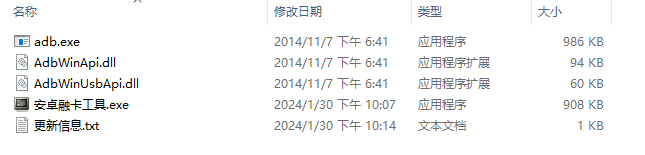
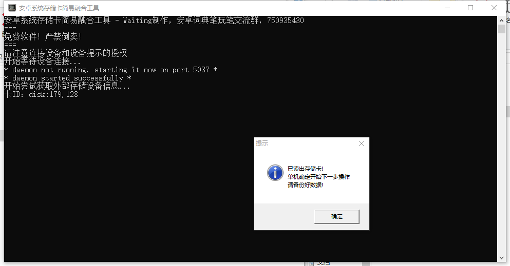
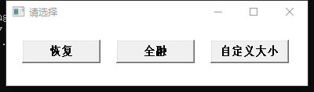
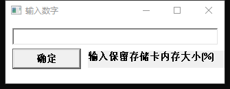
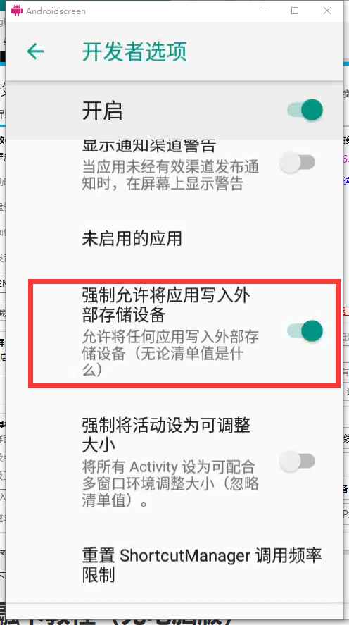
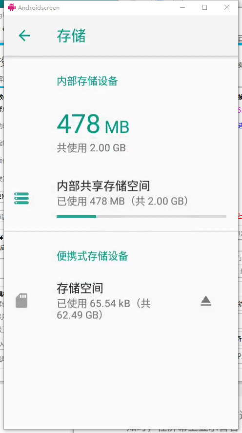
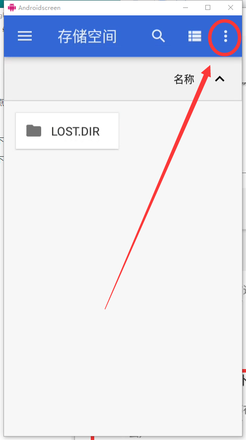
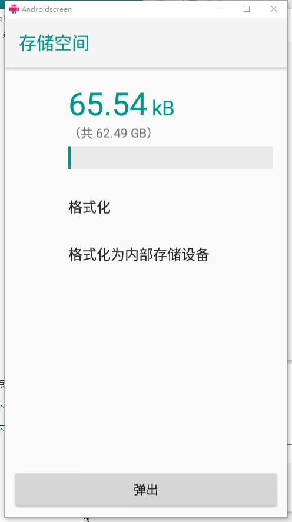
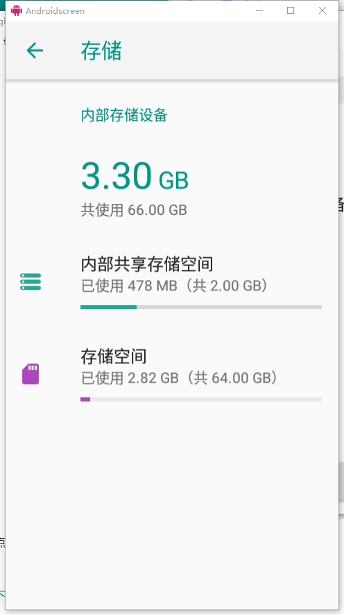

融卡前请先确认卡不是杂牌卡

# 融卡教程（电脑版）

将内存卡插入设备

[融卡软件下载](https://apk.4866.eu.org/z其他/融卡工具3.0.zip)

下载完成之后解压得到如下文件

词典笔连接电脑，点击安卓融卡工具.exe

等待出现此提示后点击确定，进行下一步操作（如果没有出现，请重试。如果还是不行，可以尝试换线，换接口，基本上就没问题了）

按照需要选择（建议自定义大小）

如果选择了自定义大小，可以选择融卡多少，一般建议输入10~50

点击确定，按回车，等待窗口消失(有时候需要手动回车)

转到词典笔端，进入开发者选项（设置-系统-开发者选项）

（部分设备没有开启开发者选项，可以在系统-关于在多次点击版本号打开）

下滑找到<强制允许将应用写入外部存储设备>打开它

融卡就完成啦

# 融卡教程（无电脑版）

没有电脑不能自定义融卡融入大小

将内存卡插入设备

进入设置，找到存储

点击便携式存储设备中的存储空间

点击右上角的三个点，点击存储设置

点击格式化为内部存储设备，点击清空并格式化，稍等一会

看见这个融卡就超过一大半了

下面进入开发者选项（系统-开发者选项）

（部分设备没有开启开发者选项，可以在系统-关于在多次点击版本号打开）

下滑找到<强制允许将应用写入外部存储设备>打开它

融卡就完成啦